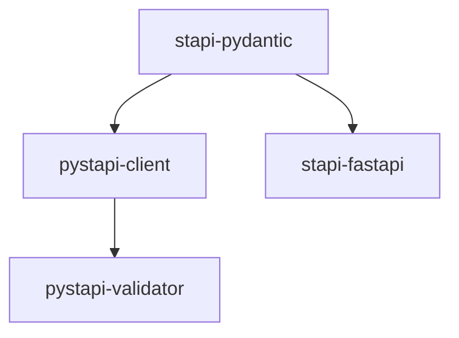

# pystapi

Monorepo for Python Satellite Tasking API (STAPI) Specification packages.

## Development

Get [uv](https://docs.astral.sh/uv/), then:

```shell
git clone git@github.com:stapi-spec/pystapi.git
cd pystapi
uv sync
```

Test:

```shell
uv run pytest
```

Check formatting and other lints:

```shell
uv run pre-commit --all-files
```

If you don't want to type `uv run` all the time:

```shell
source .venv/bin/activate
```

See our [contribution guidelines](./CONTRIBUTING.md) for information on contributing any changes, fixes, or features.

### stapi-fastapi server

A minimal test implementation is provided in [stapi-fastapi/tests/application.py](stapi-fastapi/tests/application.py).
Run it like so:

```commandline
uv run fastapi dev stapi-fastapi/tests/application.py
```

The app should be accessible at `http://localhost:8000`.

## Packages


