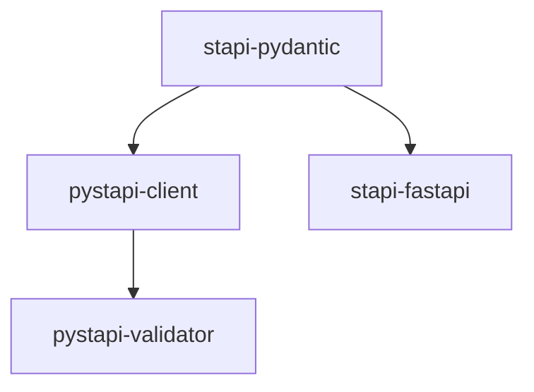

# pystapi

[](https://github.com/stapi-spec/pystapi/actions/workflows/ci.yaml)
[](https://pypi.org/project/stapi-pydantic/)
[](https://pypi.org/project/stapi-fastapi/)

Monorepo for Python Satellite Tasking API (STAPI) Specification packages.
For more, see our [docs](https://stapi-spec.github.io/pystapi/).

> [!WARNING]
> The STAPI spec, and these packages, are in their early stages of development.
> There may be large shifts in the spec or these packages' APIs as we work towards a v1.0 release of the spec.

## Packages

There are several related packages in this monorepo:



### [stapi-pydantic](./stapi-pydantic/)

[Pydantic](https://docs.pydantic.dev) models for STAPI.
These models are used to generate the STAPI OpenAPI specification, and so can be considered the source-of-truth for STAPI data structures.

### [stapi-fastapi](./stapi-fastapi/)

A backend-agnostic [FastAPI](https://fastapi.tiangolo.com/) application for serving STAPI endpoints.
A minimal test implementation is provided in [stapi-fastapi/tests/application.py](stapi-fastapi/tests/application.py).
Run it like so:

```commandline
uv run fastapi dev stapi-fastapi/tests/application.py
```

The app should be accessible at `http://localhost:8000`.

For implementations of **stapi-fastapi** with vendor-specific backends, see repos in the [stapi-fastapi Github organization](https://github.com/stapi-spec?q=stapi-fastapi-&type=all&language=&sort=).

### [pystapi-client](./pystapi-client/)

A Python API and command-line interface (CLI) for working with STAPI servers.

### [pystapi-validator](./pystapi-validator/)

A work-in-progress validator for STAPI APIs.
Currently not very useful.

## Development

Get [uv](https://docs.astral.sh/uv/), then:

```shell
git clone git@github.com:stapi-spec/pystapi.git
cd pystapi
uv sync
```

Test:

```shell
uv run pytest
```

Check formatting and other lints:

```shell
uv run pre-commit run --all-files
```

If you don't want to type `uv run` all the time:

```shell
source .venv/bin/activate
```

See our [contribution guidelines](./CONTRIBUTING.md) for information on contributing any changes, fixes, or features.
